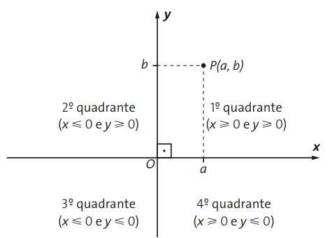
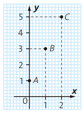



## Coordenadas cartesianas

A notação \\((a,b)\\) é usada para indicar o par ordenado de números reais \\(a\\) e \\(b\\), no qual o número \\(a\\) é a primeira coordenada e o número \\(b\\) é a segunda coordenada.

## Sistema de eixos ortogonais

Um sistema de eixos ortogonais é constituído por dois eixos perpendiculares, \\(0x\\) e \\(0y\\), que tem a mesma origem O.

O sistema de eixos ortogonais é denominado **Plano Cartesiano**, em homenagem a Descartes.

## Construção de gráficos de funções

Para construir o gráfico de uma função dada por \\(y=f(x)\\), com \\(x \in D(f)\\), no plano cartesiano, devemos:

1. Construir uma tabela com valores de \\(x\\) escolhidos convenientemente no domínio \\(D\\) e com valores correspondentes para \\(y = f(x)\\);
2. Associar um ponto do plano cartesiano a cada par ordenado \\((x,y)\\) da tabela;
3. Marcar um número suficiente de pontos até que seja possível esboçar o gráfico da função.

## Exemplo

- Gráfico da função dada por \\(f(x)=2x+1\\), sendo o domínio \\(D = \{0,1,2\}\\)

| \\(x\\) | \\(y=f(x)=2x+1\\) |
| --- | --- |
| 0 | 1 |
| 1 | 3 |
| 2 | 5 |

## Atividade

1. Construa o gráfico de cada uma das seguintes funções \\(y=f(x)\\), \\(f:\mathbb{R} \rightarrow \mathbb{R}\\)
    1. \\(f(x)=x-2\\)
    2. \\(f(x)=x\\)
    3. \\(y=2x\\)
    4. \\(y=-2x\\)
    5. \\(f(x)=x^2\\)