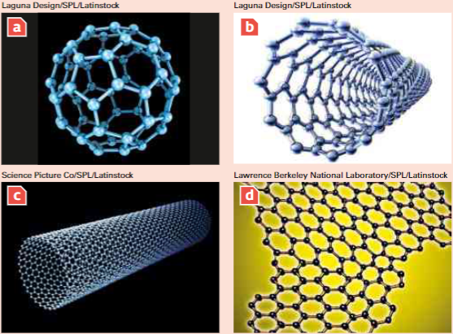



Mesmo uma ciência bem estabelecida como a Física pode passar por grandes mudanças e ter novas abordagens para a pesquisa. Desde a segunda metade do século passado, a possibilidade de construir e trabalhar com novas estruturas, lidando diretamente com átomos individuais, permitiu o desenvolvimento de um novo campo de pesquisa pura e aplicada – **a nanotecnologia**, ou **nanociência** –, que se dedica a construir estruturas com dimensões nanométricas, ou seja, de \\(10^{-9}\\) metro. 

Quando vamos para a escala do muito pequeno, podemos citar três estruturas básicas feitas de carbono puro: o fulereno, os nanotubos e o grafeno. O fulereno tem o formato de uma bola de futebol feita com 60 átomos de carbono (um átomo de carbono mede cerca de 0,07 nanômetro); os nanotubos são pequenos tubos feitos inteiramente de carbono, formando canudos que podem ter diversos diâmetros; e, por fim, o grafeno é uma espécie de tela feita somente de carbono e que pode ser tão fina quanto um único átomo de espessura. A partir do grafeno é possível construir fulerenos e nanotubos, e, utilizando os dois últimos em conjunto, podemos desenvolver diversas estruturas. Um exemplo são os cosméticos que penetram na pele mais profundamente, como os novos protetores solares, mais transparentes e menos gordurosos.

Mas não é somente na estética que a nanotecnologia tem aplicações. Nanocarregadores transportam remédios diretamente para o tecido específico, diminuindo as doses e os efeitos colaterais. Outras aplicações são os transistores, que em breve farão parte dos novos computadores. Os nanotubos de carbono também são empregados nas tintas que revestem aviões militares e em tomógrafos hospitalares. Nos aviões a pintura funciona como uma camuflagem, fazendo com que a aeronave não seja perceptível aos radares, enquanto nos tomógrafos – aparelhos que produzem imagens tridimensionais do corpo humano utilizando raios X – os nanotubos absorvem ondas eletromagnéticas que podem interferir nos sinais elétricos, reduzindo a qualidade da imagem, por exemplo, as ondas dos celulares. Porém, o desenvolvimento mais impressionante são as nanomáquinas, como o nanocarro, desenvolvido a partir de 2005. Dentro desse grupo já existem projetos de nanomotores e, possivelmente, teremos nanorrobôs, que no futuro ajudarão nos tratamentos de saúde, reconstituindo tecidos, e no combate a diversas doenças, hoje difíceis de serem tratadas, como o câncer. O mais notável é que esse campo de pesquisa é muito novo. Em 2015, o fulereno completou apenas 30 anos. Nesse mesmo ano, os pesquisadores Andre Geim e Konstantin Novoselov, professores da Universidade de Manchester, Reino Unido, receberam o prêmio Nobel por terem conseguido separar pela primeira vez uma folha de grafeno. As promessas nesse campo ainda são grandes. Cada vez mais novos físicos, químicos, biólogos, etc. têm se envolvido na pesquisa desses temas, e a nanotecnologia tem se tornado um dos ramos mais importantes da Física contemporânea.

## Questões

- **1)** A nanotecnologia envolve não somente a Física, mas também a Química, a Biologia, a Ciência da Computação, as Engenharias, etc. Porém, cada um desses campos se relaciona de forma distinta com a nanotecnologia. Escolha uma área de sua preferência e pesquise algum ponto importante nessa interação, focando especialmente como os resultados da nanotecnologia podem ajudar a desenvolver tal campo.

- **2)** Uma das preocupações relacionadas ao financiamento público de pesquisas diz respeito à aplicação de seus resultados. Quando o financiamento utiliza recursos públicos, espera-se que seus resultados sejam disponibilizados para toda a população. Todavia, o que normalmente observamos são os avanços tecnológicos disponibilizados primeiro para poucos, alcançando um público mais amplo apenas depois de muito tempo. Discuta, com seus colegas, caminhos para evitar esse tipo de resultado, focando as implicações tecnológicas da nanotecnologia.

- **3)** A nanotecnologia, por lidar com sistemas muito diferentes daqueles com os quais estamos acostumados e com propriedades que são muito recentes, nos permite imaginar que tipo de aplicação poderá aparecer no futuro. Imagine alguma tecnologia como a de um filme de ficção científica e explique o seu funcionamento a partir de estruturas nanométricas, tentando se aproximar o máximo possível da realidade.
