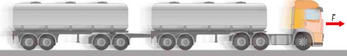
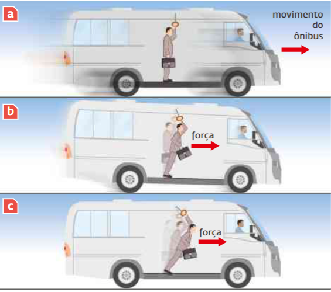
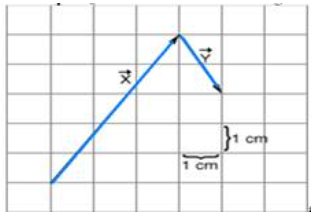
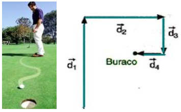



# Introdução

Vamos iniciar o estudo da Dinâmica, procurando responder a diversas perguntas, tais como: “O que provoca um movimento?”; “Há necessidade de algo para manter um movimento?”; “Quais são as causas das variações observadas em um movimento?”.
Há aproximadamente três séculos, Isaac Newton, baseado em observações suas e de outros cientistas, formulou três princípios fundamentais para solucionar problemas relacionados com os movimentos. Esses princípios foram posteriormente chamados de “Leis do Movimento”.
Essas leis constituem os pilares da Mecânica e foram enunciadas na famosa obra de Newton, Princípios matemáticos da filosofia natural, publicada em 1686. Atualmente elas são conhecidas como primeira, segunda e terceira leis de Newton, de acordo com a ordem em que apareceram na obra citada.

## Conceito de força

Quando exercemos um esforço muscular para puxar ou empurrar um objeto, estamos comunicando-lhe uma força, um caminhão exerce força para arrastar os tanques, um jato de água exerce força para acionar uma turbina, etc. Todos nós temos, intuitivamente, a ideia do que seja força.

Analisando esses exemplos, podemos dizer que, para que o efeito de uma força fique bem definido, será necessário especificar seu **módulo, sua direção e seu sentido**. Em outras palavras, **a força é uma grandeza vetorial** e pode, portanto, ser representada por um vetor.

Outro exemplo de força, com que lidamos frequentemente, é a força de atração da Terra sobre os objetos situados próximo à sua superfície. Essa força é denominada **peso do objeto**.
O peso é uma grandeza vetorial e pode ser representado por um vetor. O peso \\(\vec{P}\\) tem a direção vertical e seu sentido é dirigido para baixo.

## Medida de uma força

No caso da força, a unidade escolhida pelos físicos é o peso de um objeto padrão, o **quilograma-padrão**, que se denomina **1 quilograma-força** = 1 kgf. Outra unidade muito usada na medida de forças é o Newton \\(\to\\) 1 kgf = 9,8 N
Portanto, a força de 1 N equivale, aproximadamente, ao peso de um pacote de 100 gramas (0,1 kgf).

## Inércia

As experiências de Galileu o levaram a atribuir a todos os objetos uma propriedade, denominada **inércia**, pela qual um objeto tende a permanecer em seu estado de repouso ou de movimento. Em outras palavras, se um objeto estiver em repouso, ele, por inércia, tende a continuar parado e só sob a ação de uma força é que poderá sair desse estado; se um objeto estiver em movimento, sem que nenhuma força atue sobre ele, tende, por inércia, a se mover em linha reta com velocidade constante. Será necessária uma força para aumentar ou diminuir sua velocidade ou para fazê-lo desviar-se para um lado ou para outro. Vários fatos ligados à sua experiência diária estão relacionados com o conceito de inércia.

No instante ***a*** o ônibus está em movimento. Em ***b*** os freios começam a ser acionados pelo motorista e em ***c*** o ônibus parou. Um corpo em movimento retilíneo uniforme, por inércia, tende a continuar em movimento retilíneo uniforme.

## A primeira lei de Newton

Ao estruturar os princípios da Mecânica, Newton se baseou em estudos de outros físicos que o precederam, entre eles Galileu. A primeira lei de Newton nada mais é que uma síntese das ideias de Galileu relativas à inércia e, por isso, também é denominada lei da inércia de Galileu:

>[!info] PRIMEIRA LEI DE NEWTON
>**Na ausência de forças, um objeto em repouso continua em repouso e um objeto em movimento move-se em linha reta, com velocidade constante.**

## Atividade

1. Duas forças, \\(\vec{F_1}\\) e \\(\vec{F_2}\\), atuam sobre um pequeno objeto. \\(\vec{F_1}\\) é vertical, para baixo e vale 8,0 N, enquanto \\(\vec{F_2}\\) é horizontal, para a direita e vale 6,0 N.
	- a) Usando uma escala de 1 cm : 2 N, desenhe no caderno uma figura mostrando os vetores que representam \\(\vec{F_1}\\) e \\(\vec{F_2}\\).
	- b) Nessa figura, indique a resultante de \\(\vec{F_1}\\) e \\(\vec{F_2}\\) e, usando uma régua, determine o módulo dessa resultante.

2. Responda: 
	- a) Você sabe que seu peso é uma força vertical, dirigida para baixo. Qual é o corpo que exerce essa força sobre você?
	- b) Na linguagem diária, uma pessoa lhe diz que pesa 100 quilos. De acordo com o que aprendemos nesta seção, você deve entender que essa pessoa pesa quantos kgf? Quantos N?

3. Um estudante, procurando ter uma ideia do valor da força de 1,0 N, sustentou na palma de sua mão um pacote de 500 g. Qual é, em newtons, o valor aproximado do esforço muscular que ele fez?

4. Uma pessoa sai para dar um passeio pela cidade, fazendo o seguinte percurso: sai de casa e anda 2 quarteirões para o Norte; dobra à esquerda andando mais 2 quarteirões para Oeste, virando, a seguir, novamente à esquerda e andando mais dois quarteirões para o Sul. Sabendo que cada quarteirão mede 100m, qual é o vetor deslocamento dessa pessoa?

5. João caminha 4 metros para oeste e depois 6 metros para o sul. Em seguida, caminha 12 metros para leste. Em relação ao ponto de partida, podemos afirmar que João está a quantos metros e em qual direção?

6. Na figura a seguir estão desenhados dois vetores. Esses vetores representam deslocamentos sucessivos de um corpo. Qual é o módulo do vetor igual a \\(\vec{x} + \vec{y}\\) ?
- 

7. Um jogador de golfe necessita de quatro tacadas para colocar a bola no buraco. Os quatro deslocamentos estão representados na figura abaixo. Sendo,  \\(d_1=15\\) m, \\(d_2=6,0\\) m, \\(d_3=3,0\\) m e \\(d_4=1,0\\) m, qual era a distância inicial da bola ao buraco?
- 

