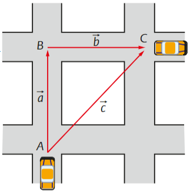
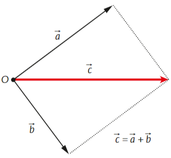



As grandezas escalares se adicionam de acordo com as regras da adição. Por exemplo, acrescentando-se \\(5 m^3\\) de água a um tanque que contém \\(2 m^3\\) de água, ele ficará com \\(7 m^3\\) de água, pois:
$$2 m^3 + 5 m^3 = 7 m^3$$
Se uma pessoa possui um terreno, cuja área é de \\(1000 m^2\\), e vende um lote desse terreno de \\(400 m^2\\)  de área, o lote restante terá uma área de: $$1000 m^2 - 400\,m^2 = 600 m^2$$
A maneira de operar com as grandezas vetoriais, entretanto, é diferente, como veremos a seguir.

## Resultante de dois vetores

Consideremos um automóvel que se desloca de A para B e, em seguida, de B para C. Na figura 1, podemos observar o automóvel e os deslocamentos, representados pelos vetores \\(\vec{a}\\) e \\(\vec{b}\\). O efeito final desses dois deslocamentos combinados é levar o carro de A para C. O vetor \\(\vec{c}\\), traçado de A para C, representa um deslocamento equivalente ao efeito combinado de \\(\vec{a}\\) e \\(\vec{b}\\). Dizemos que o vetor \\(\vec{c}\\) é a soma ou resultante dos vetores \\(\vec{a}\\) e \\(\vec{b}\\) e escrevemos: $$\vec{c}=\vec{a}+\vec{b}$$

## Regra do paralelogramo

Outra maneira de obter a resultante \\(\vec{c}\\) de dois vetores, \\(\vec{a}\\) e \\(\vec{b}\\), está representada na figura 2. Esses vetores são traçados de modo que suas origens coincidam. Por exemplo: \\(\vec{a}\\) e \\(\vec{b}\\) podem estar representando duas forças aplicadas no ponto O. Traçando-se um paralelogramo que tenha \\(\vec{a}\\) e \\(\vec{b}\\) como lados, a resultante \\(\vec{c}\\) será dada pela diagonal desse paralelogramo que parte da origem comum dos dois vetores.

## Exemplos

- Consideremos dois deslocamentos, \\(\vec{S_1}\\) e \\(\vec{S_2}\\), de módulos \\(S_1=4\,m\\) e \\(S_2=3\,m\\). Determine o vetor resultante \\(\vec{S_1}+\vec{S_2}\\) desses deslocamentos nos seguintes casos:
	- \\(\vec{S_1}\\) e \\(\vec{S_2}\\) têm a mesma direção e sentido
	- \\(\vec{S_1}\\) e \\(\vec{S_2}\\) têm a mesma direção e sentidos contrários
	- \\(\vec{S_2}\\) é perpendicular a \\(\vec{S_1}\\) 